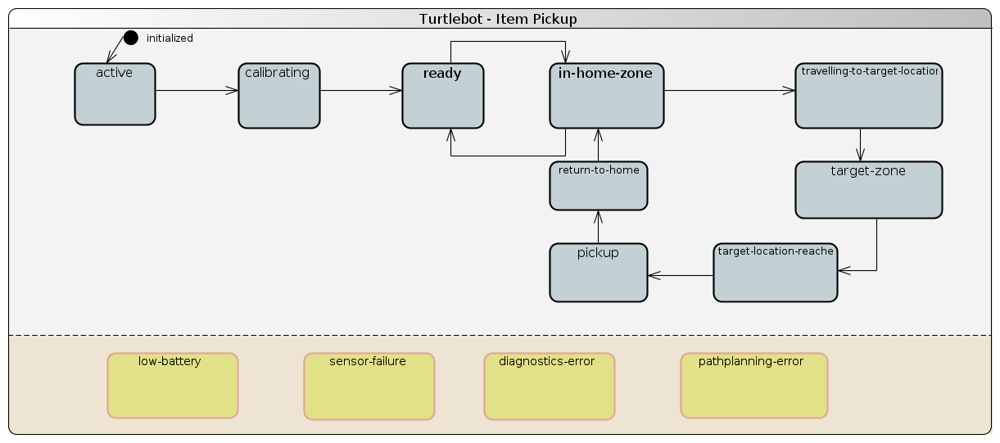

# Use Case 4: Item Pickup and Transportation

__System:__ TurtleBot

__ID:__ TRAN

__DSL File:__ [Monitoring Adaptation Rules](turtlebot_pickup.mondsl)

__Use Case:__

__State Transition Diagram:__

